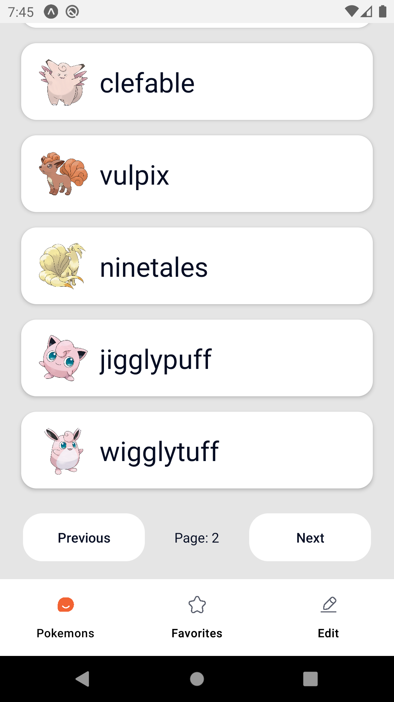

# Pokemon-React-Native

Creating a Pokemon React native app using pokemon API

# Backend API:

PokeAPI: https://pokeapi.co/

# Technologies Used:

- React
- React Native, React Native Paper
  - To create the android app
- RTK (Redux Toolkit)
  - RTK Qeury (To send HTTP requests)
- React Navigation
  - To switch between screens

# ScreenShots:

