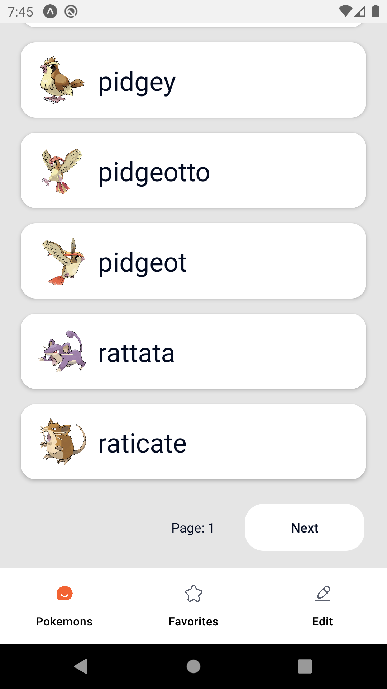

# Pokemon-React-Native

Creating a Pokemon React native app using pokemon API

# How to run:

```
git clone https://github.com/OmarThinks/Pokemon-React-Native
cd Pokemon-React-Native/app
npm install
npm run android
```

# Youtube Video:

https://www.youtube.com/watch?v=Q28u7k45Gl4

# Backend API:

PokeAPI: https://pokeapi.co/

# Technologies Used:

- React
- React Native, React Native Paper
  - To create the android app
- RTK (Redux Toolkit)
  - RTK Qeury (To send HTTP requests, and store, and cache data in redux store at once)
- React Navigation
  - To switch between screens

# Design:

I have found this design and implemented it.  
Special thanks to the designer for keeping this design open for the public.

**https://www.figma.com/community/file/1169058964714403349**


# ScreenShots:





